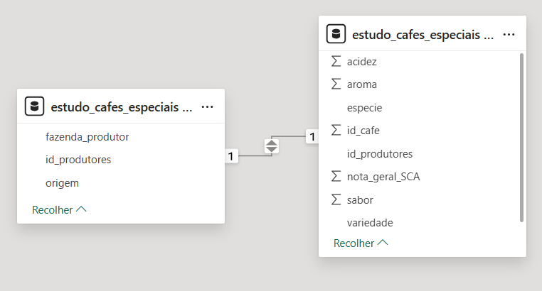

# Análise de Cafés Especiais com SQL

## Introdução

Este projeto tem como objetivo aplicar conceitos de banco de dados relacionais e comandos fundamentais de SQL em um cenário simulado sobre cafés especiais. A proposta é treinar habilidades técnicas ao mesmo tempo em que se busca desenvolver uma leitura mais analítica dos dados, extraindo informações relevantes para o contexto apresentado.

## Objetivo

O objetivo principal foi simular um cenário onde dados de cafés especiais são armazenados e analisados com SQL, promovendo:

* Prática na criação e modelagem de banco de dados relacionais;
* Exercício de comandos essenciais do SQL;
* Resolução de perguntas de negócio a partir dos dados;
* Desenvolvimento inicial de insights com base em análise exploratória.

## Estrutura dos Dados

Os dados foram gerados com o apoio de uma ferramenta de inteligência artificial, com base em fontes reais, como:

* Cup of Excellence (2023 e 2024);
* Coffee of the Year (2023);
* Specialty Coffee Association (SCA);
* Coffee Review;
* Relatórios da Embrapa;
* Artigos da Forbes, NeoFeed e Globo Rural.

Apesar da solicitação das fontes serem reais, não foi possível verificar a veracidade dos dados, logo devem-se tratar os dados do projeto como fictícios com fins exclusivamente educacionais.

## Ferramentas Utilizadas

* **MySQL**
* **MySQL Workbench**
* **SQL**
* **Power Bi** (visualização da estrutura dos dados)

## Consultas Realizadas

A seguir, algumas das consultas elaboradas com foco em cobrir os comandos básicos de SQL:

1. Listagem dos cafés com maior nota geral, incluindo produtor, país, espécie e variedade. (comando `JOIN`);
2. Contagem de amostras por espécie (`COUNT` + `GROUP BY`);
3. Produtores com nota geral acima de 91;
4. Produtores brasileiros com nota maior que 90 (`WHERE` + `AND`);
5. Média de notas por país, ordenadas de forma decrescente (`AVG`, `GROUP BY`, `ORDER BY`);
6. Produtores com nota acima da média geral (usando **subquery**);
7. Mesma análise anterior, mas utilizando **CTE** com `WITH`.

## Estrutura do Banco de Dados

A estrutura relacional foi criada com foco na normalização, separando cafés, produtores e categorias em tabelas distintas, garantindo integridade referencial e facilitando as consultas.

## Principais Aprendizados

* Criação e estruturação de banco de dados relacional;
* Consolidação de comandos fundamentais do SQL;
* Introdução ao uso de subqueries e CTEs (Common Table Expressions);
* Organização do código com foco em legibilidade;
* Compreensão inicial da transformação de dados em respostas para perguntas de negócio.

## Próximos Passos

* Aprender a integrar o banco de dados com ferramentas de visualização como Power Bi;
* Aprofundar a análise de dados com foco em métricas estratégicas;
* Trabalhar com datasets maiores e mais variados, simulando contextos reais;
* Consolidar o domínio de SQL para aplicação em projetos mais complexos.
* Adquirir conhecimento sobre novas ferramentas como o aprendizado do uso de bibliotecas do Python com foco para análise de dados.

## Contato

* [LinkedIn](https://www.linkedin.com/in/fernandomiyazato)
* [Email](mailto:mztofernando@gmail.com)